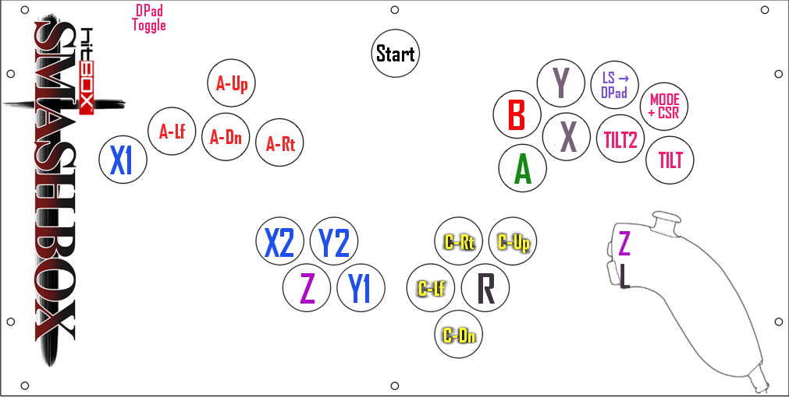

Here's the profile I'm currently using on Smash Box :pikadab:

Recommended to read through even if you end up on using  something different or
decide to lab it further.
 

# Version 1.1

(Right-Click -> Save As)

[The_Amazing_Pikachu_v1.1.sbl](../profiles/WTFinland/1.1/The_Amazing_Pikachu_v1.1.sbl)  
[The_Amazing_Pikachu_v1.1_-_Training.sbl](../profiles/WTFinland/1.1/The_Amazing_Pikachu_v1.1_-_Training.sbl)  
[The_Amazing_Pikachu_Version_1.1.sbx](../profiles/WTFinland/1.1/The_Amazing_Pikachu_Version_1.1.sbx)  

# Version 1.22

 - Values of Tilt2 and Tilt3 swapped
 - QA angles for high% enemies super easy by just [Hold(Right + Mode) + "LS-Dpad" -> Down-Backwards]
 - Tilt2
   + Dashwalk into turnaround shield
 - Make MTilt2 the same as Tilt2 so you can initiate and complete DUZ with only right hand.
 - MTilt1
   + Works for QA trumps now

[The_Amazing_Pikachu_Version_1.22.sbx](../profiles/WTFinland/1.22/The_Amazing_Pikachu_Version_1.22.sbx)

# Summary

Profile: The Amazing Pikachu  
Version: 1.1  
Game: Ultimate  
Date: 01/10/2022  
Author: WTFinland  

## Pros

 - Large angle selection
 - Easy maximum distance UpB recoveries
 - Easy neutral wavebounces
 - Access for many Pikachu-specific recovery, offensive and defensive techs.

## Cons

 - Transitioning  from  landing nair (holding A) to a consistent immediate smash
   attack (mashing B) is a bit awkward.
 - No tapjump solution for IDJs.
 - Needs  additional smashbox profile for training mode, as  L  can't  be  well
   assigned to the main layout.
 - Fingers will change between Homerow and Toprow  constantly  (problem  only if
   you can only manage 'homerow layouts')

# Control setting in Ultimate:

Default, except for
 - L -> Jump
 - C-stick -> Tilt Attack
 - Dpad left/right -> Special
 - Rumble -> Off
 - Stick Jump -> Off
 - Stick Sensitivity -> High

 

# Button Descriptions

## <Analog Stick>

Features:
 - SOCDs set as 2ip.
 - Max vector length in almost all modifier-accessed ordinal directions.
 - Diagonals give near maximal possible aerial drift within U/Dair's angle range.
 - Down-Diagonal = Thunder (Crouching & Air), Skull Bash (Standing), Dtilt, Dair.
 - Up-Diagonal = Quick Attack (Always), Utilt, Uair
 - Downward diagonals initiate Fast Fall.
 - Lenient IRAR/RAR Uairs.

## <MODE (+ CSR)>

A recovery cheat button. Transforms modified Quick Attack vectors conditionally
to  closest  possible  angle for the 2nd zip, giving  out  maximum  norm-2  sum
vectors (ie. length between the starting point of the first zip  and the ending
point of the second zip is maximal).

Features:
 - While  holding  an  ordinal direction, normal version zip will combo to mode
   version zip on X1, X2, Tilt2, Base, Tilt, Y2 and Y1.
 - Optimal  Mode  angle  is always the one closer to x-axis. If you want to flip
   the order of the zips, do Mode angle first.
 - Mode versions of Y2 and Y1 use 8-bit overflow on the y-axis (up is down, down is up).
 - Default Y center heightened by 44. Won't initiate tapjump (if set on).
 - All Mode  modifiers  altered  according  to the coordinate transformation and
   will give the UpB angles from 1.0.
 - Can initiate UpB using only right hand with [Mode + B]

## <Tilt>

Used for walking, angled f-tilts and instant Dash Attack.

Features:
 - Chaining [Horizontal direction -> Tilt+A] outputs an instant Dash Attack.
 - Max medium walk speed.
 - Maintains teeter.
 - Diagonals give angled F-tilts (ground) and F/Bairs (air).
 - Placed so that rest of the GC buttons and Tilt 2 are easily accessible while holding down Tilt.

## <Tilt2>

Used for walking, turnaround U/D-tilts, platform falltrough and dash walking.

Features:
 - Tapping Tilt2 is enough for the dash walk -method to work.
 - Medium walk speed.
 - Maintains teeter.
 - Allows for neutral B, reverse-B and B-reverse.
 - Diagonals give normal and turnaround U/D-tilts (ground) and U/Dairs (air).
 - Gives platform fallthrough without initiating Fast  Fall.  Can  be  used  for
   timing aerials after slow platform fallthrough.
 - Tilts shield without rolls or spotdodges.
 - Placed so that rest of the GC buttons and Tilt are accessible while holding down Tilt2.

## <X1>

Used for drifting Z-drops and UpB angles.

Features:
 - Slow walk speed
 - Z will drop an item even when holding a horizontal direction.
 - Placed so that can be held while or plinked with [Z -> A or C-stick] for Z-drop aerials.
 - Diagonal UpB X1 -> MX1 gives a steep recovery angle.
 - Good for buffering turnarounds with Left/Right buttons  when  trying  to time
   U-smash or D-smash, since  they  don't  need to be released for the Up/Down + A
   input.
 - Offensive  UpB[Forward  ->  X1  +  Down-Backward]  on the ground  spawns  an
   extremely short returning hitbox for the latter zip, making it  possible to hit
   a  far off enemy twice while still stopping behind them. Changing X1  to  other
   linear modifiers  changes the sliding length of the returning zip for adjusting
   to enemy's distance or for mixupping shield crossups.

## <X2>

Used for neutral B techs, drifting double jump Thunders and UpB angles.

Features:
 - Medium walk speed.
 - Allows for neutral B, reverse-B  and  B-reverse  (maximum aerial drift within
   the limit of not outputting Skull Bash).
 - While in air [Hold(down diagonal+X2) + Y -> B] outputs a drifting double jump
   Thunder, which just barely  connects  with  Pikachu, making the spiked enemy to
   (depending on the enemy's DI) either get  blasted  to  the  direction  of  your
   choosing or miss the Blue Thunder completely. The "Y->B" sequence is a 15-frame
   chain, making it very lenient and giving a  large  frame window for reacting to
   anticipated enemy movements.
 - Diagonal UpB X2 -> MX2 gives a near 45° recovery angle.
 - UpB[Up-Backward + X2 -> Up-Forward + X1] allows  for non-2-frameable recovery
   when Pikachu is  close  to  lower  blast  zone  and  directly  below the ledge.
 - Good angle for ground sliding QA trumps,  as framewise it gives you some room
   for error for releasing A-Down so you don't SD

## <Y2>

Used for UpB angles.

Features:
 - Diagonal UpB Y2 -> MY2 gives a shallow recovery angle.
 - MY2 uses 8-bit overflow to get a negative degree angle.
 - UpB can't be activated by holding up diagonal + MY2 before pressing B,  as it
   initiates Skull Bash.

## <Y1>

Used for UpB angles.

Features:
 - Diagonal UpB Y1 -> MY1 gives a horizontal recovery angle.
 - MY1 uses 8-bit overflow to get a negative degree angle.
 - Framewise  diagonal  UpB Y1 -> MY1 is offensively similar to the traditional
   forward to down-forward diagonal zips on the ground, with the difference of low
   profiling the enemy less but having a longer attack distance.
 - Offensive UpB[Forward -> Y1 + Down-Backward] on the ground gives the  longest
   slide for the returning zip.
 - For higher %s, UpB[Up-Forward + Y1/Mode -> Down-Back] works wonders.
 - UpB can't be activated by  holding up diagonal + Y1/MY1 before pressing B, as
   it initiates Skull Bash.

## <Tilt3>

Mostly Pikachu bullshit fuckery techs. Inputted with Tilt+Tilt2.

Features:
 - The X-coordinates have been 8-bit overflown.
 - Double Up Zips.  Just  use UpB and hold Tilt3 to either horizontal direction.
   Both up zips can be activated with the coordinates (41,0)  as  long as the move
   doesn't start from the ground.
 - Easy non-2-frameable upB recovery to ledge from straight below the ledge with
   [Hold(Up-Backward + Tilt2) + B -> Tilt3]. The optimal  distance  from the ledge
   is a bit shorter than with the less simple X2X1-method.
 - During initial Dash  while  holding  forward, tap or plink the Homerow to get
   Short or Full Hop IRAR Bair. Add A-Up for Uair versions.
 - Similar inputs with A changed to B  output  either  neutral wavebounce out of
   jump or iRAR neutral B-reverse depending on timing. Both serve the  exact  same
   purpose.
 - Thunderwall Slide;

When in zero/small horizontal aerial momentum, Fast Fall with holding Tilt3 and
Down-Diagonal, tap B and then release Tilt3 to perform a drifting Thunder where
Pikachu barely misses  the  first  thunderbolt  and  then  drifts back into the
second one. After the summoning end lag,  Pikachu  can  use  any  normal in-air
option (except spawning Thunder)  OR launch an instant Blue Thunder with DownB.
Amazing tech when falling from ceiling blastzone in  disadvantage,  as  Pikachu
can   offensively/evasively   UpB  from  inside  the  thunderbolt,  while   the
approaching enemy has to  watch out for the projectile and respect the possible
(on  reaction)  Blue  Thunder  which breaks Pikachu's fall,  has  invincibility
frames and a large killer hitbox. TWS has some use in  edgeguarding also, as it
can be  used  to  stall  at  the  bottom  blast zone (enemy has to respect your
optional  Blue  Thunder  stall,  since you can mix up your tjt timing with  it)

## <LS->Dpad>

Super easy and lenient Neutral B-reverses and  Neutral  B  Wavebounces.  Can be
used for UpB.

Features:
 - When in air, while holding forward, plink [Analog-Backward -> "LS->Dpad"] for
  a  Neutral Wavebounce. Make sure you don't keep "LS->Dpad" pressed  for  longer
  than 3 frames.
 - When drifting and holding Backwards, tap "LS->Dpad" for B-reverse.
 - Pre-hold any* angle for UpB by [Hold(Direction)  ->  Mode + "Ls->Dpad"]. Good
   for  initiating Mode zip  combo  angles  in  both  orders,  and  for  offensive
   horizontal zips from running.

both normal and Mode directions work, but the angle must have non-zero x-vector
since only dpad left/right is set to Special

## <C-Left / C-Right>

Used for IRAs, Z-drop F/Bairs and B-reverse Thunders. Otherwise quite on the sidelines.

Features:
 - Easy C-Stick induced iRAR Bairs with X/Y. Relevant and important tech for comboing (read: spamming).
 - Use [Backward -> Down-Backward + B -> C-Forward] at wall to Carvia Thunder for climbing or stalling.
 - Separated from modifiers, Jumps, and Z for Z-Drop F/Bairs
 - Can  be  used  for  instant  Dash Attacks and Neutral B-reverses, but it  is
   recommended to do them with other methods.

## <C-Up>

Placement  above R for quick thumb access. Used especially for Uair bridges and
together with Fast Falling.

Features:
 - Good location for Z-drop aerials.
 - Fast Falling from Uair is easy with attack being inputted with C-Up, as there
   is no need to quickly switch from Analog-Up to A-Down.
 - C-Stick Fast Fall -method can be tapped with this button, works well both for
   Uair Bridges and for Uair to Thunder combos.

## <C-Down>

Placement below R for quick thumb  access.  Used especially for Dair Fast Falls
and Dtilt to instant Dash Attack links.

Features:
 - Good location for Z-drop aerials.
 - Plink [C-Down -> A-Down] for simplest Dair FF.
 - Spamming D-tilt with C-Down is  good,  as  one  can  easily  link  D-tilts to
   instant Dash Attack with [Forward -> Tilt+A].

## <Z>

Placed so that Z can be chained with X1,  directional buttons, X, A and C-Stick
and Multitilts for Z-drop techs and turnaround grabs in Nair loops. Anchor your
thumb on Z or betwixt X2 and Z.

Features:
 - Maximum  acceleration  Neutral  Air  Dodges  can  be  achieved  with  better
   consistency using Z rather than R due to placement. For example on Battlefield,
   when ledge hanging, [A-Down  ->  X  -> Z -> C-Forward -> A-Forward] to get drop
   down DJ Neutral Air Dodge to a platform.

## <R>

Placed in middle of the thumb cluster for instant access. Anchor you thumb here.

Features:
 - Access to Jump, UpB, Dodges, Shieldgrab and Shield tilt from holding Shield with ease.

## <X and Y>

Located next to A and B as they are plinked together constantly, while allowing
Multitilts to be held also.

Features:
 - Can be plinked with C-Left/Right for iRAR Bairs.
 - IDJ can be  performed  by plinking either button. There is space for plinking
   the  Y  too,  as  there is a larger gap for a finger to slide to in the middle,
   between   the   top   and  homerow.  Y  works  especially  for  IDJ   Thunders.
 - IDJ can also be performed by sliding a finger from Y to X.

## <A>

On the Homerow with Jump and Multitilts for priority access.

## <B>

Placed next to  Jump,  Mode  is  efficiently  on  the  same row, Multitilts are
accessible. B+A Smash (Holding one and mashing the other) isn't the simplest to
do,  but  can  be  achieved  with  index  finger   and   thumb/middle   finger.

## <L>

Only used in training profile and quitting matches. Replaces Y, so jumping must
be performed with X when speed is set to 1 Frame.

